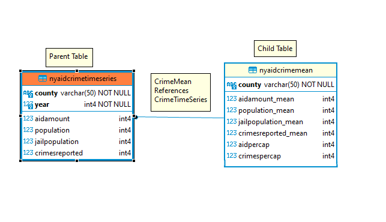

# NY-Criminality-DataStudy-Python
Data Study on the effect of public education funding on criminality in New York state divided by counties, done in Python

# Introduction

This project will focus on New York State School Aid, where we will
study every county’s educational government subsidy and then refer it to
its criminal and development rates between . A Database is required due
to the amount of data and analysis that needs to be done does not exist
in a singular place, instead of being relegated to different data sets
that are far apart from each other in terms of accessibility .

This will be of great interest to New York’s administration as proof for
schooling’s importance, as they can study these figures and try to
answer some questions like does there exist a correlation between these
factors to see if increasing education finances leads to less criminal
communities.

Our data sources will be provided by the state located in Open Data NY,
where we will, extract, clean, normalize, and analyze different data
sets, such as: New York State School Aid, Lottery Aid to Education,
Annual Population Estimates, Jail Population. Each dataset has been
chosen by their feature of being divided by county and year, allowing us
to select specific time and year.

# Schema design

The domain constraints are satisfied; each value is atomic and pertains
to it’s specific type, key constraints are defined as constraint keys,
they are the county and year for one table and county for the other.

Entity integrity is satisfied as every County is stated, the same for
year, no NULL values are present, as for keys: the foreign key from the
child table that links both tables is the same as one from parent
table’s constraint keys.The foreign key will guarantee that one keys in
one table have a corresponding row in the other table. Below is the E/R
diagram and relational schema

## E/R Diagram

## Relational Schema

-   `NYAidCrimeTimeSeries`:
    (County,Year,AidAmount,Population,JailPopulation,CrimesReported)

    PRIMARY KEY(County,year)

    FOREIGN KEY (County) REFERENCES NYAidCrimeMean (County)

-   `NYAidCrimeMean`:
    (County,AidAmountmean,Populationmean,JailPopulationmean,CrimesReportedmean,AidPerCap,CrimesPerCap)

    PRIMARY KEY (County)

# Acquiring and sampling the data

We acquired all the datasets from the NY Open Data website
https://data.ny.gov/ and started working on them, we made python scripts
to clean and make them fit for our schemas and load into the databases
correctly (for example we had to convert some column types since some of
the int values were stored as strings)

After that we designed a sample database that contained the two tables
but with only a small subset of the data for easier testing, there are
scripts for creating/loading/altering/updating/destroying tables from
the database.

# Dependencies and Normalization

Now we start verifying that our data are in Boyce-Codd normal form. So
we need to confirm that our database correctly enforces first, second
and third normal form.

Our dependencies are:

NYAidCrimeTimeSeries (County,Year) -\>
(AidAmount,Population,JailPopulation,CrimesReported)

NYAidCrimeMean County -\>
(AidAmountmean,Populationmean,JailPopulationmean,
CrimesReportedmean,AidPerCap,CrimesPerCap)

Starting by the First Normal Form we know all columns only contain
atomic values, there is not a mix of types of values in any row, each
column has a unique name and the order of the rows does not matter,
using SQL queries you can fetch data in any order.

Second Normal Form and Third Normal Form tells us that our database
should not have any partial and transitive dependencies, which it does
not have as in the time series table every non-composite key column
depends on both county and year, the same happens for county in the mean
table.

As for BCNF, the schema already complies with this principle, as for
every dependency in the database A-\>B, A is always a primary/composite
key while B never derives from a prime attribute as B never gives enough
data to locate any other row or itself.

# Databse creation & Troubleshooting

After designing, acquiring and normalizing the database, we started
testing on the sample tables, we found out quickly that 2 scripts for
each operation were needed as postgres didn’t like having a script that
operated in 2 tables which had foreign key constraints in one of them.
We altered all of our scripts so that you have to execute a script to
create/load/alter/delete/etc in a specific order, NYAidCrimeMean first
since its the one that does not need a reference to work

Since the mean table data depends exclusively on the timeseries we
revoked the privilege to update it from any user, since changing any
value there would not reflect correctly the data from the timeseries.

Another problem that we had to solve was that if the any of the data
from the timeseries is modified then it should also update the mean
table, technically speaking this should not happen since the data thats
entered in most cases it will never be modified, but in the rare case it
did we decided to implement measures, so for this we created triggers
that executed SQL queries that updated the mean table after someone
tries to update the timeseries. Some triggers update more than others,
for example if someone updates the population from the timeseries it
will update Populationmean, Aidpercap and CrimesPerCap, while updating
JailPopulation will only change JailPopulationmean.

1\. Hate Crimes by County and Bias Type: Beginning 2010 \| State of New
York \|
https://data.ny.gov/Public-Safety/Hate-Crimes-by-County-and-Bias-Type-Beginning-2010/6xda-q7ev/data
. Census 2000 and 2010 Population, Towns \| State of New York \|
https://data.ny.gov/Government-Finance/Census-2000-and-2010-Population-Towns/fqf5-9nc2/data
. Annual Population Estimates for New York State and Counties: Beginning
1970 \| State of New York \|
https://data.ny.gov/Government-Finance/Annual-Population-Estimates-for-New-York-State-and/krt9-ym2k
. Jail Population By County: Beginning 1997 \| State of New York\|
https://data.ny.gov/Public-Safety/Jail-Population-By-County-Beginning-1997/nymx-kgkn/data
. Index Crimes by County and Agency: Beginning 1990 \| State of New
York\|
https://data.ny.gov/Public-Safety/Index-Crimes-by-County-and-Agency-Beginning-1990/ca8h-8gjq/data
. Adult Arrests 18 and Older by County: Beginning 1970 \| State of New
York \|
https://data.ny.gov/Public-Safety/Adult-Arrests-18-and-Older-by-County-Beginning-197/rikd-mt35
. Description of 2020-21 New York State Executive Budget Recommendations
for Elementary and Secondary Education \|
https://www.budget.ny.gov/pubs/archive/fy21/exec/local/school/2021schoolaid.pdf
. New York State School Aid: Beginning School Year 1996-97 \| State of
New York \|
https://data.ny.gov/Government-Finance/New-York-State-School-Aid-Beginning-School-Year-19/9pb8-dg53/data
. New York State School Aid: Two Perspectives, Thomas P. DiNapoli 2016
\|
https://www.osc.state.ny.us/files/local-government/publications/pdf/schoolaid2016.pdf
